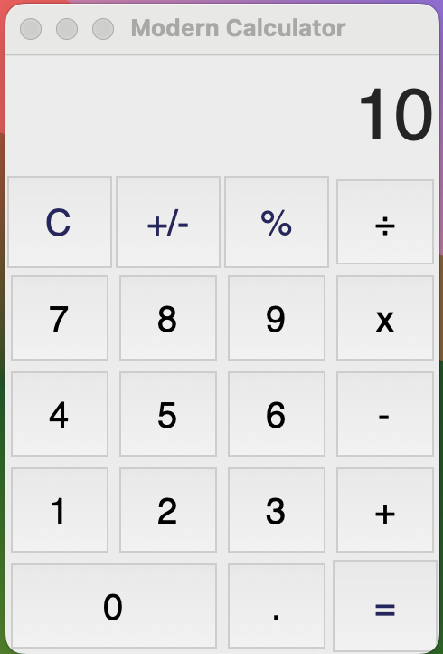

# Modern Calculator

This project is a Modern Calculator built using Python and Tkinter. The application offers a sleek, user-friendly interface and supports basic arithmetic operations, percentage calculations, and negation.

## Features

- **Basic Arithmetic Operations**: 
  - Addition (`+`)
  - Subtraction (`-`)
  - Multiplication (`x`)
  - Division (`÷`)

- **Percentage Calculation**: 
  - Calculate percentages of numbers easily.

- **Negation**: 
  - Toggle between positive and negative values.

- **Clear Functionality**: 
  - Clear the current input to start a new calculation.

## Installation

To run this project, you need to have Python installed along with the Tkinter library, which is usually included with Python installations.

## Usage

1. Clone the repository:
```sh
git clone https://github.com/yourusername/modern-calculator.git cd modern-calculator
```
2. Run the script:
```sh
python calculator.py
```
3. Use the buttons on the calculator interface to perform calculations.
## Screenshots



## Contributing

Contributions are welcome! If you have any ideas for improvements, feel free to fork the repository and submit a pull request.

## License

This project is licensed under the MIT License - see the LICENSE file for details.

## Acknowledgements
